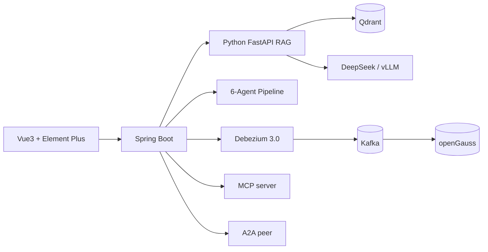

# 智迁云枢 ZhiQian YunShu 🚀

> **LLM Agent + Knowledge Graph 驱动的跨方言数据库迁移智体**
>
> MySQL/Oracle/SQLServer → openGauss/PostgreSQL, 一键智迁, AI 可解释, 生态互联。

[]() []() []() []() []() []()

## 仓库定位

本仓库是 **智迁云枢 v2.0** 完整可运行版,在原 `sourcecode/` (v1 存档) 基础上, 在新目录 `zhiqian/` 重写 backend / rag / web / deploy / docs。

```
zhixianyunshu/
├── README.md                  本文档
├── CHANGELOG.md               v2 全部 32 个 milestone + 7 加分 commit 详情
├── UPGRADE_PLAN.md            二期路线图 + 决策日志
├── sourcecode/                v1 存档, 不再变动
└── zhiqian/                   v2 主工作区
    ├── backend/               Spring Boot 3.3 主服务
    ├── rag/                   Python 3.11 FastAPI RAG
    ├── web/                   Vue 3.4 + Element Plus 控制台
    ├── deploy/                Kustomize / ArgoCD / KubeRay / CDC / 公开数据集
    ├── docs/                  架构图 / 对比 / 创新点
    └── security/              供应链策略 + SBOM 模板
```

## 三个“一句话”选型

- **不只是迁移工具**: 6 Agent + CRAG + GraphRAG 读懂跨方言复杂语句。
- **不锁定一个生态**: pgloader / Ora2Pg / Debezium / ZhiQian Native 同位调度。
- **双协议互联**: MCP server + A2A peer, 能被 Claude Desktop / Cursor 调, 也能与其他 Agent 交互。

## 技术栈

| 层 | 选型 |
| --- | --- |
| 后端 | Spring Boot 3.3 · Spring Security · OpenAPI · Temporal Java SDK (opt) · JaCoCo 0.8.12 |
| RAG | Python 3.11 · FastAPI · BGE-M3 · Qdrant · sqlglot · Outlines · LangGraph mini |
| 前端 | Vue 3.4 · Vite 5 · Element Plus 2.7 · Pinia · vue-i18n 9 · ECharts · transformers.js v3 |
| 部署 | Kustomize · ArgoCD · KubeRay · Debezium 3.0 · Kafka Connect · Docker Compose |
| 安全 | Syft SBOM · Trivy · Cosign keyless · SLSA Build L2 |
| 可观测 | Langfuse · Spring Boot Actuator · 全链 trace |

## 快速起动 (本地 5 分钟)

```bash
# 1) 克隆
git clone https://github.com/anothersunset/zhixianyunshu.git
cd zhixianyunshu

# 2) 一键 Demo (拉起 mysql/opengauss/qdrant 三服务)
bash scripts/demo-walkthrough.sh

# 3) 打开控制台
open http://localhost:5173    # admin / admin123
```

手动起服务 (熟手):

```bash
# 后端
cd zhiqian/backend && ./mvnw spring-boot:run
# RAG
cd zhiqian/rag && uvicorn app.main:app --port 8001
# 前端
cd zhiqian/web && pnpm i && pnpm dev
```

## 演示路径

1. **登录** → admin / admin123
2. **选项目** `benchmark-sakila`
3. **走一次 SQL 转** (MySQL → openGauss), 看 6 Agent 流水 trace
4. **下载 Typst PDF 报告** —— 含风险表 + SQL 示例
5. **切换主题为暗色** + 语言切为英文
6. **入口 `/edge`** 跳 端侧小模型 Demo (需下 600MB)
7. **入口 `/present`** 跳到幻灯片演示模式 (PPT 备诺)
8. **用 Claude Desktop 调 MCP**: `claude_desktop_config.json` 里填上 `http://localhost:8001/mcp/rpc`

## 架构一眼看



详架构看 `zhiqian/docs/architecture/`。

## v2.0 完成清单 (32 / 32)

- [x] Phase 1 (#1-#10): 架构重写, 6 Agent, DeepSeek, BGE-M3 三路, Outlines, JaCoCo 门禁
- [x] Phase 2 (#11-#17): GraphRAG, CRAG mini, Late Chunking, Langfuse, Kustomize, secretGenerator
- [x] Phase 3 (#18-#24): ArgoCD GitOps, KubeRay, Debezium CDC, MigrationToolFactory, MCP server, A2A peer
- [x] 加分 (#25-#32): 暗色+i18n, 演示模式+TTS, Typst PDF, 端侧推理, 公开数据集, 论文架构图, 供应链安全, 顶级 README

全部提交详情 → [CHANGELOG.md](./CHANGELOG.md)

## 同类产品对比

详 [zhiqian/docs/comparison.md](./zhiqian/docs/comparison.md), 与 AWS DMS / Alibaba DTS / Ora2Pg / pgloader / DataX / RAGFlow / Verba 对比 6 维度。

## 许可

Apache License 2.0

## 致谢

DeepSeek · BGE · sqlglot · Debezium · openGauss · Typst · transformers.js · Anchore · Aqua · Sigstore
