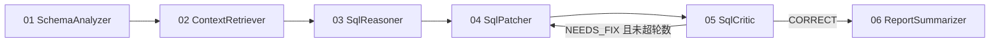
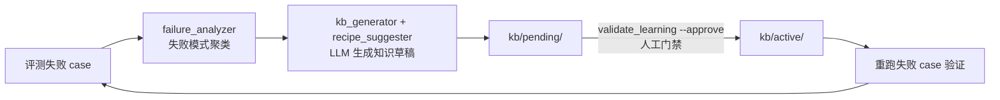

# 垂直领域 Agent 设计：以跨方言 SQL 迁移为例

> 本文是智迁云枢的**方法论文档**：不罗列功能，而是回答"一个垂直领域 Agent 与'通用 LLM + 提示词'的本质区别是什么"，并把每个设计决策映射到本仓库的具体代码。适合想理解架构意图的贡献者、以及把本项目当作垂直 Agent 参考实现来读的人。

---

## 0. 核心论点

通用 Agent 的能力上限由基座模型决定；**垂直领域 Agent 的能力上限由领域知识的工程化程度决定**。在 SQL 方言迁移这种"错一个函数就全错"的领域，单靠更大的模型无法收敛，必须靠五个支柱协同：

| 支柱 | 一句话 | 本仓库落点 |
| --- | --- | --- |
| ① 领域知识工程 | 知识分层、单一真源、审批治理 | `kb/` + 三层知识模型 |
| ② 任务编排 | 状态机 + 反思回环，而非一次直出 | `zhiqian/backend/.../agent/` |
| ③ 领域接地检索 | 混合检索 + 校正式 RAG + 图谱补充 | `zhiqian/rag/app/` |
| ④ 评测驱动开发 | 客观指标先行，LLM judge 须经人工校准 | `eval/` |
| ⑤ 失败学习闭环 | 从真实失败自动生成知识，人工门禁部署 | `eval/failure_analyzer.py` 等 |

下文逐一展开。

---

## 1. 支柱一：领域知识工程 — 三层知识模型

微调把知识焊死在权重里，纯 RAG 把知识摊平成文本。本项目把领域知识按**精度与触发方式**拆成三层（详细论述见 [devlog](./devlog-2026-06-24-failure-learning-loop.md)）：

```
Layer 1  KB 文档       粗粒度背景知识，语义检索命中     → LLM 参考
Layer 2  转换配方       精确"源→目标"映射 + few-shot     → 注入提示词
Layer 3  特征触发器     扫描 SQL 识别问题特征            → 决定注入哪些配方
```

这个分层的关键洞察：**配方（Layer 2）的召回不能依赖语义相似度**。"CONNECT BY 转 WITH RECURSIVE"的配方，必须在源 SQL 出现 `CONNECT BY` 时 100% 注入，语义检索做不到这个保证——所以 Layer 3 用确定性的特征扫描器（`FeatureScannerAgent`，先剥离注释与字符串字面量再扫描，避免误触发）做触发，Layer 1 才交给向量检索。

**知识治理**同样是工程问题：所有知识出自单一 YAML 真源；LLM 生成的新知识先进 `kb/pending/`，经 `python -m eval.validate_learning --approve` 人工审批后才进 `kb/active/`；`kb/backups/` + `kb/deploy_log.json` 提供回滚与审计。知识库没有治理就会随时间腐化，这是垂直 Agent 长期运营的第一杀手。

---

## 2. 支柱二：编排 — 轻量状态机与反思回环

### 2.1 六节点管道 + 条件回环

主管道由 `AgentGraph`（LangGraph 风格状态机，全部实现约 30 行，见 `agent/AgentGraph.java`）编排，在 `task/TaskExecutionService.buildGraph()` 装配：



反思回环（critic → patcher）是 Self-Refine / Reflexion 思想的最小可用实现：

- `SqlCriticAgent` 用**独立的 reasoner 模型**按 7 项领域清单（分页、层级查询、UPSERT 等高频翻车点）评审补丁，输出结构化 `STATUS: CORRECT | NEEDS_FIX` 与 `needs_correction` 布尔量；
- 路由边读取 `needs_correction`，未超 `MAX_REFINE_ROUNDS` 时把执行送回 patcher；
- `SqlPatcherAgent` 把上一轮 `critique` 拼进重修提示词，第二次生成据此修正；
- 轮数上限防止"两个 LLM 互相不满意"的死循环，critic 调用失败时**乐观放行**（评审是增益不是闸门，API 故障不应阻塞主流程）。

### 2.2 双路径路由：不是所有请求都值得六站全跑

`MigrationEvalController` 里有第二张图：确定性的复杂度打分（行数、JOIN 数、方言特征词命中……）决定走**快路径**（特征扫描 + 配方直接注入 RAG 转译）还是**全路径**（六节点管道）。这是垂直 Agent 的成本纪律：领域里 70% 的输入是简单模式，让它们付六次 LLM 调用的成本是浪费。

### 2.3 取舍：为什么自实现 30 行状态机而不用 LangGraph

- 后端是 Java/Spring 体系，引 Python 编排框架意味着跨进程状态同步；
- 本领域的图结构简单（一条主链 + 一个回环 + 一个路由分支），框架的增量价值低于其依赖成本；
- 自实现让 SSE 步进事件、Langfuse span、confidence 透出都能贴着 `AgentStep` 做，可观测性无缝。

**这个取舍有边界**：若未来出现并行分支、人在环中断点续跑，就应该重估。框架不是信仰，是成本函数。

---

## 3. 支柱三：领域接地检索 — 检索也要懂方言

### 3.1 混合检索基座

`rag/app/pipelines/hybrid_retrieve.py`：BM25（术语精确命中，SQL 关键字是强信号）+ BGE-M3 向量（语义）双路，RRF（`store/rrf.py`）融合，可选 bge-reranker 重排。SQL 领域文本"术语密度高、语义相似度失真"（`DECODE` 和 `CASE WHEN` 语义等价但字面无关），单一通道都不够。

### 3.2 CRAG：检索质量本身要被评估

`rag/app/graphs/crag.py` 自实现轻量路由型 DAG（约 110 行，不依赖 langgraph）：

```
retrieve → evaluate ─┬─ correct   → refine → generate
                     ├─ ambiguous → refine ∥ web_search → merge → generate
                     └─ incorrect → web_search → refine → generate
```

Corrective RAG 的核心信条：**检索结果不可默认可信**。评估器给检索打分，低分路由到 web 补充检索。GraphRAG（`graphs/graphrag.py`）作为第三通道补充跨文档的结构关系（外键、函数族谱系），有 top-3 与权重阈值裁剪防止图谱噪声反噬。

### 3.3 方言感知过滤

`ContextRetrieverAgent` 在打分时解析查询中的方言对（`oracle->postgresql`），带 `source_dialect`/`target_dialect` 元数据的文档**方向不符直接零分**，泛 SQL 术语（`select`、`table`）权重衰减 75%。通用检索器不知道"MySQL 的配方对 Oracle 迁移是毒药"——方言方向这个领域先验必须显式编码进检索层。

---

## 4. 支柱四：评测驱动开发

完整体系见 [eval/README.md](../eval/README.md)，此处只讲设计原则：

1. **客观指标先行**：`sql_equivalent`（sqlglot AST 级等价，而非字符串比对）、`recall_at_k`、`report_point_hit_rate`。能用程序判定的绝不请 LLM。
2. **LLM judge 必须校准**：`judge.py` 打分之后，`human_review.py` 分层抽样人工复核，算 Cohen's κ。κ 不达标的 judge 分数不进结论。
3. **消融是标配**：`bm25 / vector / vector_rerank / crag / full` 五档同数据集对比，每个组件的贡献可量化——"加了 GraphRAG"不是成果，"GraphRAG 使 hard case 命中率 +N%"才是。
4. **评测基础设施也是产品**：preflight 自检、watchdog 自愈、断点续跑。跑不完的评测等于没有评测。

---

## 5. 支柱五：失败学习闭环



这是本项目最有普适价值的部分：**知识从真实失败中生成，而非从理论出发预设**。已验证 38/38 失败 case 修复；devlog 进一步论证了该框架可平移到数学建模等其他垂直领域（三层知识模型是领域无关的）。

两个反直觉的设计点：

- **LLM 生成知识，但人类守门**。自动生成的配方可能过拟合单一 case 甚至自相矛盾（曾出现 CONNECT BY LEVEL 语义冲突的文档，靠审批环节拦下）。
- **闭环的单位是"失败模式"而非"失败 case"**。先聚类再生成，一个配方治一类病，避免知识库被 case 级补丁淹没。

---

## 6. 横切关注点

- **全链可观测**：Langfuse root trace 贯穿 task → 每个 agent 节点 span → LLM generation，SSE 步进事件携带 traceId，前端可一键跳转定位任意一次任务的完整执行树（`AgentRunner` + `observability/`）。垂直 Agent 的调试单位是"这一次任务哪一站出了什么"，没有 trace 树就只能盲猜。
- **结构化输出**：`rag/app/core/structured_output.py`，JSON Schema 校验 + 可选 Outlines 采样层约束，降级链路完整（Outlines → provider JSON mode → 校验重试）。
- **优雅降级作为默认姿态**：RAG 失联降级本地 mock 检索、critic 失败乐观放行、edge-tts 缺失降级浏览器 TTS、typst 缺失降级 JSON 导出。垂直 Agent 交付的是流程可用性，不是单点炫技。
- **生态协议**：MCP server（`rag/app/mcp/server.py`，Claude Desktop / Cursor 可直接调用迁移能力）+ A2A peer（`backend/.../a2a/`）。垂直 Agent 的终局不是孤岛应用，是可被编排的领域能力单元。

---

## 7. 文献锚点

| 设计 | 对应工作 | 本仓库实现 |
| --- | --- | --- |
| 反思回环 | Self-Refine (Madaan et al. 2023) / Reflexion (Shinn et al. 2023) | `TaskExecutionService` critic 条件路由 |
| 校正式检索 | CRAG (Yan et al. 2024) | `rag/app/graphs/crag.py` |
| 自反思 RAG | Self-RAG (Asai et al. 2023) | `rag/app/pipelines/self_rag.py` |
| 图谱增强 | GraphRAG (Edge et al. 2024, Microsoft) | `rag/app/graphs/graphrag.py` |
| 多路融合 | RRF (Cormack et al. 2009) | `rag/app/store/rrf.py` |
| LLM 评审员 | LLM-as-a-Judge (Zheng et al. 2023) + κ 校准 | `eval/judge.py` / `eval/human_review.py` |
| 多语义向量 | BGE-M3 (Chen et al. 2024) | `rag/app/core/bge_m3.py` |
| 状态机编排 | LangGraph 的设计思想（自实现） | `agent/AgentGraph.java` |

---

## 8. 工程健壮性：让实验与状态机可信

垂直 Agent 的能力再强，如果**评测测不准、状态机会骗你**，一切都无从谈起。这一节记录三处已修复的"底子"问题——它们比任何单点能力都更决定项目可信度。

### 8.1 消融梯度失真的三个根因（已修复）

实验跑完却看不到梯度、甚至递减，根因几乎不是模型，而是实验条件被污染：能力静默降级（BGE 降级为 hash 伪向量、reranker 静默 noop）、检索降级混入实验组（部分 case 走 mock 检索）、指标饱和（集合型 Recall 测不出 rerank/CRAG 改变的排序）。三者已分别用**能力探针**、**`retrieval_real` 污染守卫**、**排序敏感的 MRR@10** 加固——完整论述见 [eval/README.md §5](../eval/README.md)。要点：*每一档实验条件必须只差你要消融的那一个变量*。

### 8.2 状态机的三个陷阱（已修复）

- **FAIL 却上报 completed**：`AgentRunner` 遇节点异常会 break，但 `TaskExecutionService` 原先无条件 `trace.finish(status=completed)`——失败的任务在 Langfuse 里显示成功。现按 step 的 FAIL 状态如实上报 `failed` 并推 SSE `failed` 事件。
- **路由死循环**：反思回环若配置失误（无出口条件），`while(cur != null)` 会无限跑。加 `MAX_STEPS=32` 全局兜底，超限以 FAIL 终止。
- **路由到不存在的节点**：`graph.node(cur)` 返回 null 会直接 NPE。加空节点守卫，以可读的 FAIL step 终止而非崩溃。

三者均有单测覆盖（`AgentRunnerTest` 的 `RuntimeGuards` / `ReflectionLoop`）。

### 8.3 仍待推进

- 反思回环 `MAX_REFINE_ROUNDS=1`，未做"critic 意见是否被采纳"的定量评测——下一步在 eval 加回环收益消融档。
- 快/全路径的复杂度打分是手写启发式，长期应从评测数据中学习路由阈值。
- Layer 3 特征扫描器与 Layer 2 配方的映射靠人工维护，失败学习闭环产出的新配方尚需手动补触发特征。
- GraphRAG 的图构建是轻量 CKG，未做增量更新。

——以上每一条都刻意保留在文档里：**知道边界在哪，和知道能力在哪同样重要。**
