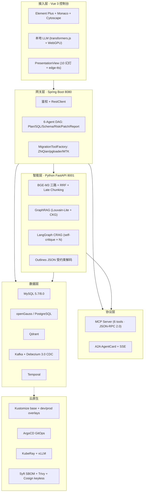

# 总架构 · 顶层概览

> 本页为项目顶层架构概览。深入实现看 [`zhiqian/docs/architecture/`](../../zhiqian/docs/) (下面小节里链了具体文件)。

## 一句话

智迁云枢 = **6-Agent DAG** 驱的 **MySQL→openGauss/PostgreSQL** 代码与数据一体化迁移平台, 背靠 **BGE-M3 三路检索 + GraphRAG + LangGraph CRAG** 提高准确率, 云原生部署 + 供应链安全闭环。

## 6 层架构 (top-down)



## 关键详情文档

| 架构跳转 | 详细位置 |
| --- | --- |
| 6-Agent DAG | [`01-agent-pipeline.md`](./01-agent-pipeline.md) |
| RAG 三路检索 | [`02-rag-retrieval.md`](./02-rag-retrieval.md) |
| 实现级架构 (full mermaid) | [`zhiqian/docs/architecture/00-overall.md`](../../zhiqian/docs/architecture/00-overall.md) |
| Agent 细粒度 pipeline | [`zhiqian/docs/architecture/01-agent-pipeline.md`](../../zhiqian/docs/architecture/01-agent-pipeline.md) |
| RAG 详细检索面 | [`zhiqian/docs/architecture/02-rag-retrieval.md`](../../zhiqian/docs/architecture/02-rag-retrieval.md) |

## 部署拓扑

### 本地演示 (最小)
```
[浏览器 5173]
    → [web Vite dev server]
    → [backend Spring Boot :8080]
         → [RAG FastAPI :8001]
              → [Qdrant :6333] [DeepSeek API]
         → [MySQL :3306] [openGauss :5432]
```

### 生产 (Kubernetes)
```
[Ingress] → [web nginx] [backend HPA 2-8] [RAG HPA 2-4]
           → [vLLM via KubeRay autoscale 1-4] [Qdrant cluster]
           → [MySQL + openGauss + Kafka + Debezium + Temporal]
[ArgoCD] — GitOps → kustomize/overlays/prod
[Sealed Secrets] — 加密 secret 可进 Git
```

## 设计原则

1. **默认优雅降级** — 未装 typst/edge-tts/transformers.js/Temporal/CDC 都返 503 不崩服务
2. **依可选** — ML 依走 `requirements-ml.txt + BUILD_ML=1`
3. **供应链透明** — 每个 artifact 都有 SBOM + Cosign 签 + Rekor 公开可查
4. **GitOps 可反复** — 一切部署状态都在 Git, dev=auto, prod=manual+selfHeal
