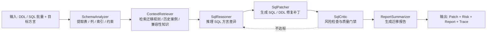

# Agent DAG · 顶层概览

> 本页为 Agent pipeline 顶层设计。详细实现看 [`zhiqian/docs/architecture/01-agent-pipeline.md`](../../zhiqian/docs/architecture/01-agent-pipeline.md)。

## 6 Agent DAG

## 关键点

- **以代码为准** — 当前真实执行链路来自 `TaskExecutionService.buildGraph()`，固定为 SchemaAnalyzer / ContextRetriever / SqlReasoner / SqlPatcher / SqlCritic / ReportSummarizer 6 个节点。
- **ContextRetriever 内接 CRAG / GraphRAG** — RAG 能力作为检索与纠错子流程嵌入 6 Agent DAG，而不是额外算作第 7 个业务 Agent。
- **SqlCritic 推上游** — 质量门禁不达标时推回 SqlReasoner 重试，避免错误 patch 直接进入报告。
- **工具可插拔，Agent 主体不变** — transpile_sql / lookup_doc / score_sql 等 tool 可以增减，但业务 Agent 数量仍以 6 个节点为准。
- **可观测** — 每个 Agent stage 都可记录 Langfuse trace、token、duration 和结构化输出。

## 为什么不是单 Agent

| 问题 | 单 Agent 状况 | 6 Agent DAG |
| --- | --- | --- |
| Context 长 | 容易混杂 schema / SQL / 风险 / 报告任务 | 每个 Agent 只处理一个阶段 |
| 错误传播 | SQL 改写错误可能直接进入报告 | SqlCritic 风险门禁隔离 |
| 可重试 | 失败后往往要全链路重跑 | 只重跑出错阶段或推回 reasoner |
| 可观测 | 一条混合 trace，难定位瓶颈 | 6 段 trace，能定位 hot spot |
| 工程交付 | 输出常是自然语言建议 | 输出 Patch + Risk + Report + Trace |
