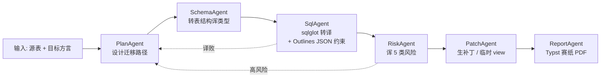

# Agent DAG · 顶层概览

> 本页为 Agent pipeline 顶层设计。详细实现看 [`zhiqian/docs/architecture/01-agent-pipeline.md`](../../zhiqian/docs/architecture/01-agent-pipeline.md)。

## 6 Agent DAG

## 关键点

- **全部走 LangGraph CRAG** — 每个 Agent 调 RAG 后 self-critique × N, 低信任重检
- **受约束解码** — 结构化输出走 Outlines + pydantic, 不会给多话文
- **GraphRAG 补 RAG** — 问表下游依赖 · 跳表推理 · 社区检索
- **可话 duration** — Temporal worker 底, 走 24h+ 长项不丢状态
- **可观测** — 每调一次 Agent 上 Langfuse trace, 费用/期件都看到

## 为什么不是单 Agent

| 问题 | 单 Agent 状况 | 6 Agent DAG |
| --- | --- | --- |
| Context 长 | 股聊、逻辑乱 | 每 Agent 聊一件事, prompt 短 |
| 错误传播 | SQL 错陆到 schema | Risk gate 隔离, 退 Plan |
| 可重试 | 全重走 | 只重走出错 Agent |
| 可观测 | 一条 trace | 6 段 trace, 揭变 hot spot |
| 代价 | LLM 调用少 | 调多, 但重试少, 总 cost 词汇 |
