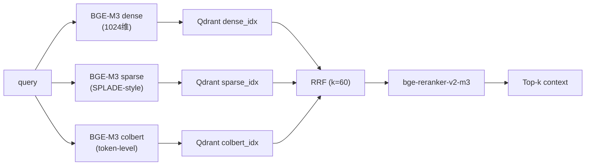

# RAG 检索 · 顶层概览

> 详细实现看 [`zhiqian/docs/architecture/02-rag-retrieval.md`](../../zhiqian/docs/architecture/02-rag-retrieval.md)。

## 当前存储口径

- 向量检索：**Qdrant + BGE-M3 + RRF**。
- 图检索：**CKG / GraphRAG 轻量图实现**，不以 Neo4j 作为当前实现口径。
- 旧稿中的 ChromaDB / Neo4j 表述仅作为早期方案，不用于说明当前可运行版本。

## 三路检索



## 为什么 BGE-M3
- 一个能同时做语义理解、关键词搜索、长文本搜索、多语言搜索的 embedding 模型。
- 单模型 3 种表示（dense / sparse / colbert）—— 不需另启三个模型。
- 多语言（100+）—— 中文规则、英文接口、SQL 术语可走同一套检索口径。
- 8K 上下文 —— 配合 Late Chunking 保留跨 chunk 语义。

## Late Chunking

传统：`chunk → embed`（语义被切碎）
Late：`embed full doc → mean-pool chunks`（语义跨 chunk 保留）

> **评测口径**：当前文档不把 Late Chunking / CRAG / GraphRAG 直接包装成已证明的真实业务收益。后续需要用迁移样本集补充 Recall@5、Top-5 precision、证据充分性和人工相关性对照。

## RRF 为什么 k=60

- 原论文（Cormack 2009）实验默认。
- 作为当前融合参数 baseline，后续应在真实迁移数据集上继续调参。
- 公式：`score = Σ 1 / (k + rank_i)`。

## GraphRAG 补位

```
问: “users 表改名会影响哪些下游表?”
  · 三路检索 → 返 users 表定义
  · GraphRAG / CKG → 从表依赖边扩展，返 orders / profiles / payments 等下游路径
```

当前 GraphRAG / CKG 已具备 local / global 图检索思路；默认语义判断仍包含启发式成分，真实语义增益需要通过多跳问题正确率和风险识别率验证。
