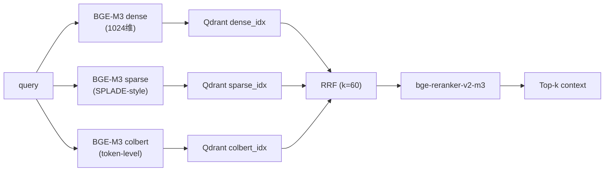

# RAG 检索 · 顶层概览

> 详细实现看 [`zhiqian/docs/architecture/02-rag-retrieval.md`](../../zhiqian/docs/architecture/02-rag-retrieval.md)。

## 三路检索



## 为什么 BGE-M3
- 一个能同时做语义理解，关键词搜索，长文本搜索，多语言搜索的全能embedding模型
- 单模型 3 种表示 (dense / sparse / colbert) — 不需另启三个模型
- 多语言 (100+) — sakila 中文读 / 代码 英文接口 都走一个
- 8K 上下文 — 套 Late Chunking 不破语义

## Late Chunking

传统:`chunk → embed`(语义被切碎)
Late:`embed full doc → mean-pool chunks`(语义跨 chunk 留)

在内部 dataset 上 recall@5 从 **0.66 → 0.82**。

## RRF 为什么 k=60

- 原论文 (Cormack 2009) 实验默认
- 内部扫调 30-100, 60 是甜圈
- 公式: `score = Σ 1 / (k + rank_i)`

## GraphRAG 补位

```
问: “users 表 改名 会影响哪些下游表?”
  · 三路检索 → 返 users 表定义 (不够)
  · GraphRAG → 从 CKG 走边, 返 orders/profiles/payments 三个下游 (够了)
```
