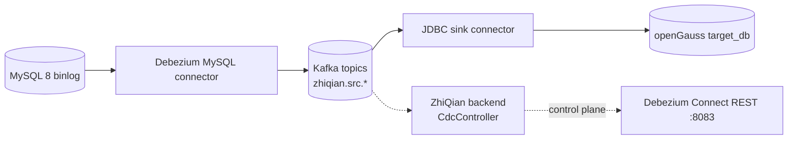

# Debezium 3.0 CDC pipeline

> v2-step-21。实现 MySQL → Kafka → openGauss 的实时增量迁移 (避免应用双写 / stop-the-world)。

## 架构



## 启动

```bash
# 1) 起 CDC stack (Kafka + Connect + MySQL)
docker compose -f zhiqian/deploy/cdc/docker-compose.yml --profile cdc up -d
docker compose -f zhiqian/deploy/cdc/docker-compose.yml ps

# 2) 在 source MySQL 创表进样本数据
docker exec -i $(docker ps -qf name=cdc-mysql-source) mysql -uroot -pzhiqian source_db <<'SQL'
CREATE TABLE IF NOT EXISTS customers (id INT PRIMARY KEY AUTO_INCREMENT, name VARCHAR(64), email VARCHAR(128));
CREATE TABLE IF NOT EXISTS orders (id INT PRIMARY KEY AUTO_INCREMENT, customer_id INT, total DECIMAL(10,2), created_at TIMESTAMP DEFAULT CURRENT_TIMESTAMP);
CREATE TABLE IF NOT EXISTS products (id INT PRIMARY KEY AUTO_INCREMENT, name VARCHAR(128), price DECIMAL(10,2));
INSERT INTO customers(name,email) VALUES ('Alice','alice@example.com'),('Bob','bob@example.com');
INSERT INTO products(name,price) VALUES ('GPU',9999.00),('CPU',2999.00);
SQL

# 3) 注册 source connector
curl -X POST -H 'Content-Type: application/json' --data @zhiqian/deploy/cdc/connectors/mysql-source.json http://localhost:8083/connectors | jq

# 4) 启动 openGauss target (复用主 docker-compose 的 postgres / 或单起一个 opengauss 容器)
# 交叉连接到 cdc 网络: docker network connect cdc_default zhiqian-postgres

# 5) 注册 sink connector
curl -X POST -H 'Content-Type: application/json' --data @zhiqian/deploy/cdc/connectors/opengauss-sink.json http://localhost:8083/connectors | jq

# 6) 验证数据到达 target
docker exec -i zhiqian-postgres psql -U zhiqian -d target_db -c 'SELECT * FROM customers;'

# 7) 生产 binlog event、看是否同步
docker exec -i $(docker ps -qf name=cdc-mysql-source) mysql -uroot -pzhiqian source_db -e \
  "INSERT INTO customers(name,email) VALUES('Carol','carol@example.com');"
sleep 5
docker exec -i zhiqian-postgres psql -U zhiqian -d target_db -c 'SELECT count(*) FROM customers;'
```

## backend 控制面

- `GET    /api/cdc/connectors` 列出所有 connector
- `POST   /api/cdc/connectors` 注册 connector (body = Debezium JSON)
- `GET    /api/cdc/connectors/{name}/status`
- `POST   /api/cdc/connectors/{name}/restart`
- `POST   /api/cdc/connectors/{name}/pause` / `/resume`
- `DELETE /api/cdc/connectors/{name}`

启用: `app.cdc.enabled=true`, `app.cdc.connect-url=http://localhost:8083`。默认 enabled=false, 不启 Connect 时 controller 返 503。

## 生产加固
- [ ] 全量 snapshot 取 row-level lock, 避开业务高峰
- [ ] Schema history 拼 topic, replication factor=3
- [ ] DLQ topic + alert (指错误记录可人工介入)
- [ ] outbox pattern 避免业务事务与 CDC 不一致
- [ ] Strimzi Kafka operator + KafkaConnect CR (K8s)
- [ ] 启用 SCRAM-SHA-512 身份 / TLS
