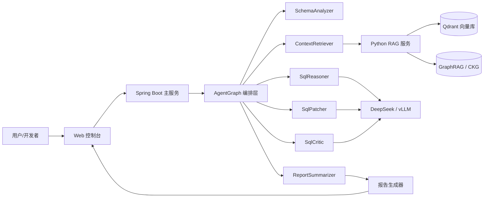

# 智迁云枢 系统架构

## 总体架构图

## 6 个业务 Agent

> 以当前代码中的 `TaskExecutionService.buildGraph()` 为准：真实执行链路是 6 个 Agent 节点，不再使用旧文档中的 7 Agent 口径。

| Agent | 职责 | 主要工具 / 依赖 |
|---|---|---|
| SchemaAnalyzer | 分析源库 DDL / schema，提取表、列、索引、约束与迁移风险 | DDL 解析、规则提示词 |
| ContextRetriever | 检索迁移规则、历史案例与数据库兼容性知识 | Python RAG、BGE-M3、Qdrant、GraphRAG |
| SqlReasoner | 推理 SQL 方言差异，给出转换思路与风险解释 | DeepSeek / vLLM、sqlglot |
| SqlPatcher | 生成 SQL / DDL 修复补丁和迁移改写结果 | sqlglot、补丁生成提示词 |
| SqlCritic | 检查 patch 是否合理，识别兼容性、性能和语义风险 | LLM judge、规则评分、重试门禁 |
| ReportSummarizer | 汇总 schema 分析、检索依据、patch、风险与 trace，生成迁移报告 | Markdown / Typst 报告链路 |

## 业务闭环

1. 用户创建迁移任务，提交源库 DDL / SQL 与目标数据库方言。
2. SchemaAnalyzer 分析 schema、索引、约束和潜在风险。
3. ContextRetriever 检索迁移规则、历史案例和兼容性知识。
4. SqlReasoner 推理方言差异与迁移策略。
5. SqlPatcher 生成可审查的 SQL / DDL 修复补丁。
6. SqlCritic 对补丁做风险检查；不达标时回到 SqlReasoner 重试。
7. ReportSummarizer 生成最终迁移报告，前端展示 patch、risk、report 和 trace。

## 技术栈

### 后端
- Spring Boot 3.3 · Spring Security · OpenAPI · Temporal Java SDK（可选）
- AgentGraph · DeepSeek RestClient · Langfuse SDK
- MigrationToolFactory · pgloader / Ora2Pg / Debezium / ZhiQian Native 适配

### RAG
- Python 3.11 · FastAPI
- BGE-M3 · BGE reranker · Qdrant · RRF 三路混合检索
- CRAG mini StateGraph · GraphRAG / CKG · sqlglot · Outlines 受约束解码

### 前端
- Vue 3.4 · Element Plus · Vite 5 · Pinia · ECharts · SSE

### 部署
- Docker Compose · Kustomize · ArgoCD · KubeRay / vLLM（可选）
- Debezium 3.0 · Kafka Connect · openGauss / PostgreSQL
- Syft SBOM · Trivy · Cosign keyless · SLSA Build L2
