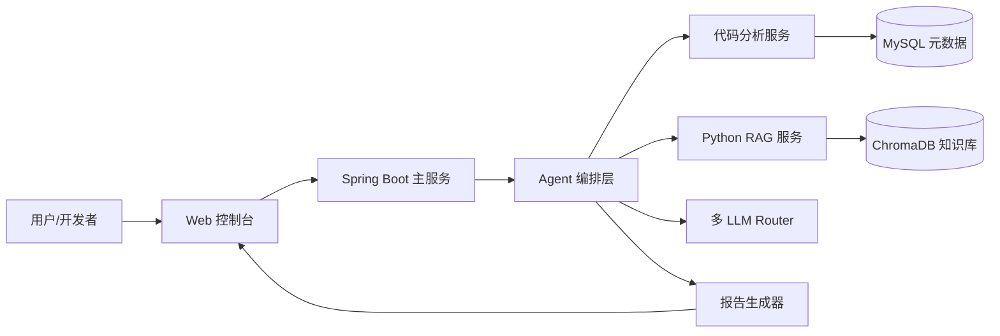

# 智迁云枢 系统架构

## 总体架构图

## 7 个业务 Agent

| Agent | 职责 | 主要工具 |
|---|---|---|
| Planner | 任务拆解 + Agent 调度 | 任务图、状态机 |
| CodeAnalyzer | 解析 Maven/Gradle、扫描依赖、识别中间件 | AST 解析器、依赖图 |
| SQLCompat | 识别 SQL 方言、判断国产库兼容性 | SQL Parser、规则库 |
| KnowledgeRetriever | 查询信创适配规则与历史案例 | RAG 混合检索 |
| SolutionGen | 生成改造建议、替换方案 | 多 LLM、提示词模板 |
| Evaluator | 风险评分、工作量评估 | 评分模型、规则引擎 |
| Auditor | 记录依据、置信度、版本(Hash 链) | 溯源链、日志库 |

## 业务闭环

1. 用户上传项目压缩包或 Git 地址
2. Planner 创建迁移任务
3. CodeAnalyzer 输出依赖/SQL/配置画像
4. KnowledgeRetriever 召回适配规则与案例
5. SolutionGen 输出改造清单
6. Evaluator 给出风险评分与工作量
7. 用户在控制台审核并人工复核
8. 报告生成器导出最终交付物
9. Auditor 记录全过程到审计日志(Hash 链)

## 技术栈

### 后端
- Spring Boot 3.2 · Spring Security 6 · MyBatis 3.0.3 · MySQL
- jjwt 0.11.5 · Flyway 10 · Micrometer + Prometheus
- JGraphT 1.5.2 · JSqlParser 4.9 · JavaParser 3.25 · java-diff-utils 4.12

### RAG
- Python 3.11 · FastAPI
- BGE-M3 (0.4/0.2/0.4) · BGE-reranker-v2-m3 (Top-50→Top-5)
- HyDE · Self-RAG (max_loops=2, conf ≥ 0.7)
- ChromaDB · NetworkX

### 前端
- Vue 3.4 · Element Plus 2.7 · Vite 5 · Pinia

### 部署
- Docker Compose · Grafana 11
- 信创适配:统信 UOS / 麒麟 / 毕昇 JDK
