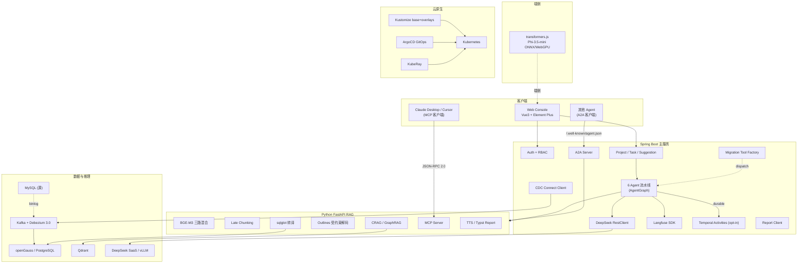

# 智迁云枢总体架构

> v2-step-30. 反映本仓库 v2.0 状态(32 提交 + 7 加分)。

## 设计原则

1. **三层清晰**。Web / Backend / RAG 独立升级,Backend 面向业务 + Java 依赖;RAG 面向 LLM + Python 生态。
2. **双协议入口**。MCP 让 ZhiQian 被外部调(serve),A2A 让 ZhiQian 与其他 Agent 互联(peer)。
3. **迁移不锁定一条路**。ZhiQian Native / pgloader / Ora2Pg / Debezium 四轨并行,MigrationToolFactory 推荐。
4. **云原生**。Kustomize 原生 + ArgoCD GitOps + 可选 KubeRay (生产型 GPU 推理)。
5. **端侧零推理成本**。transformers.js Phi-3.5-mini 走浏览器,隐私高的场景可脱后端。
6. **可观测**。Langfuse + JaCoCo 门禁 + Temporal 事件 = 全链追踪 + 结算 + 重试。
