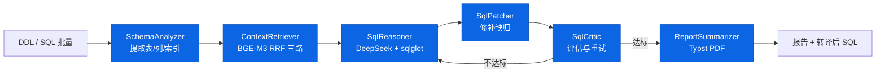

# 6 Agent 流水线

> v2-step-30. AgentGraph 是 #3 提交引入的 DAG。

## 与反转架构区别

- **水平不走 Master-Slave**: 每个 Agent 主动拉上一个输出,不依赖总控制。
- **SqlCritic 推上游**: 质量门禁不达标时推 SqlReasoner 重试(最多 3 次)。
- **默认 6 Agent 不装卸**: tools 可插拔(transpile_sql / lookup_doc / score_sql),Agent 主体不变。

## 与 LangGraph CRAG 的对接

- ContextRetriever 内部走 mini StateGraph (#12 提交): retrieve → evaluate → correct → generate。
- evaluator 双轨: LLM judge 与启发式(token 覆盖 + 重叠 IoU)。
- 补救走 web search + 重检索(`/crag/query`)。
