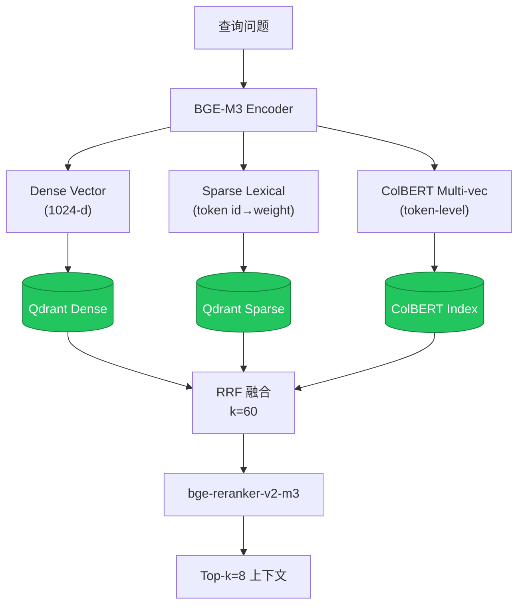
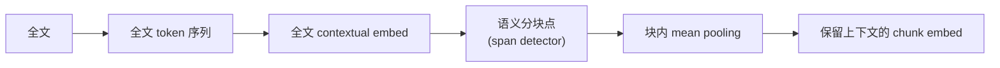

# RAG 检索架构

> v2-step-30. BGE-M3 三位一体 + RRF + reranker。

## 当前实现口径

- 向量库：**Qdrant**。
- 图谱 / GraphRAG：**CKG / 轻量图实现 / Louvain-Lite 思路**。
- CRAG / GraphRAG 的控制流已实现；默认评估仍包含启发式 baseline，真实语义增益需通过对照实验验证。

## Late Chunking

## GraphRAG 口径

- 节点类型：Table / Column / Index / Procedure / View / FK。
- 边类型：HAS_COLUMN / FK_REF / INDEXED_BY / CALLS / VIEW_OF。
- 社区检测：Louvain-Lite 思路，不依赖 Microsoft graphrag-toolkit。
- 问答分双轨：
  - **local**：命中实体 → 1-hop 邻居 → LLM。
  - **global**：跨社区 summary 召回。

## 后续评测计划

| 实验组 | 目的 | 指标 |
| --- | --- | --- |
| BM25 only | 关键词 baseline | Recall@5、人工相关性 |
| Vector only | 语义检索 baseline | Recall@5、证据充分性 |
| Vector + Rerank | 验证重排序收益 | Top-5 precision、答案正确率 |
| CRAG | 验证低质量检索修复能力 | CRAG fix rate、fallback precision |
| GraphRAG / CKG | 验证跨表/依赖推理收益 | 多跳问题正确率、风险识别率 |
