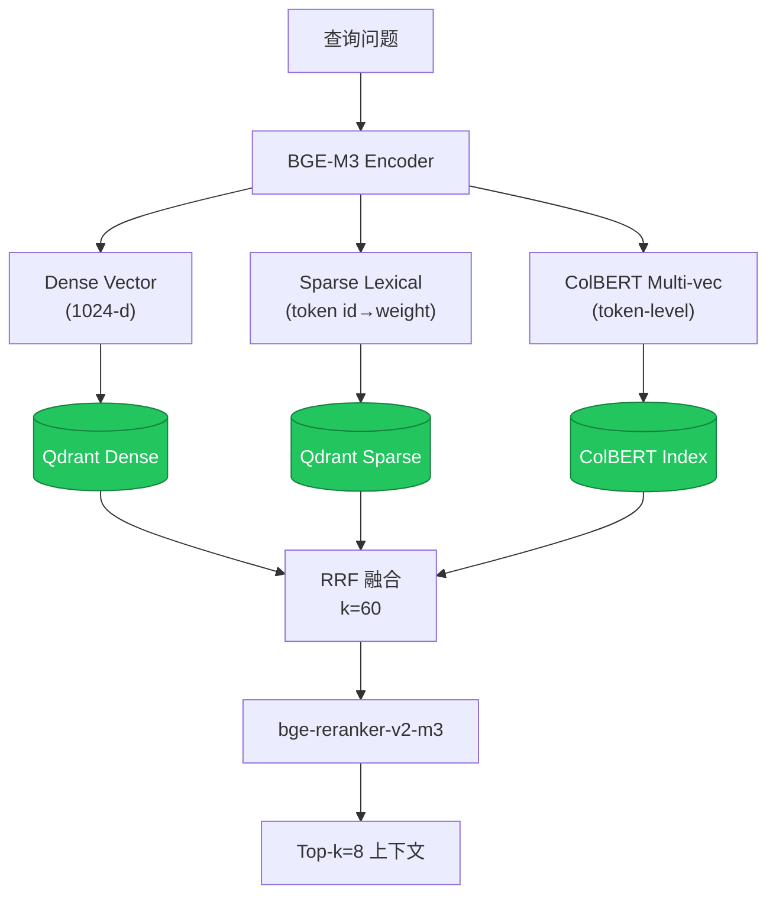
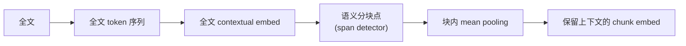

# RAG 检索架构

> v2-step-30. BGE-M3 三位一体 + RRF + reranker。

## Late Chunking

## GraphRAG 口词

- 节点类型: Table / Column / Index / Procedure / View / FK
- 边类型: HAS_COLUMN / FK_REF / INDEXED_BY / CALLS / VIEW_OF
- 社区检测: Louvain-Lite 自实现(不依 graphrag-toolkit)
- 问答分双轨:
  - **local**: 错锈点 → 1-hop 邻居 → LLM
  - **global**: 跨社区 summary 聊天
